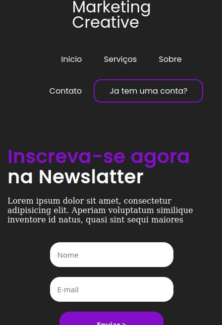
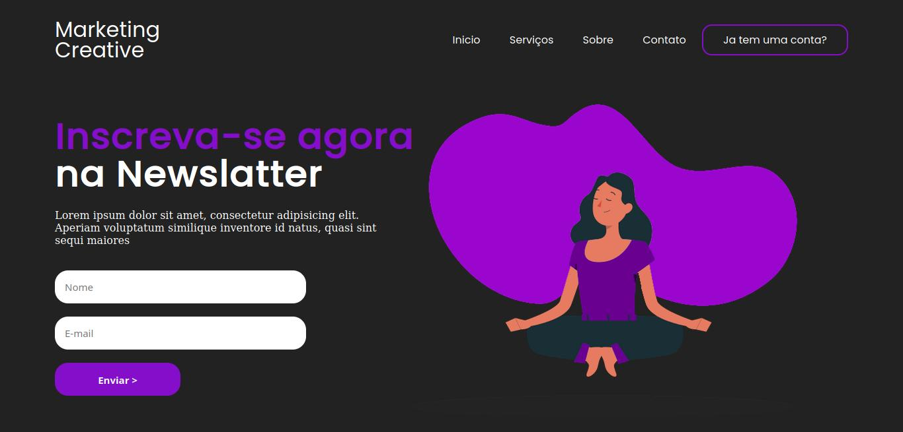

<h1 align="center">
      <a href="#" alt="site-creative"> Marketing Creative</a>
</h1>

<h4 align="center">
	🚧   Concluído 🚀 🚧
</h4>

## 💻 Sobre o projeto

marketing creative trata-se de uma landing page responsiva simples e elegante.

---

## ⚙️ Funcionalidade

- [x] responsividade no layout
  - [x] formulario de cadastro
  - [x] animações suaves

---

## 🎨 Layout

### Mobile

  

### Web

 

  

---

## 🛠 Tecnologias

As seguintes ferramentas foram usadas na construção do projeto:

#### **Website**

**[html](https://developer.mozilla.org/pt-BR/docs/Web/HTML)**
**[css](https://developer.mozilla.org/pt-BR/docs/Web/CSS)**
